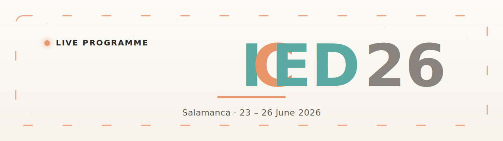

<div align="center">



<br/>

<p>
  <a href="#"></a>
  <a href="#"></a>
  <a href="#"></a>
  <a href="LICENSE"></a>
</p>

<h3>The official live programme web app for the ICED26 conference.</h3>
<p><i>Salamanca · 23 – 26 June 2026 · <a href="https://iced26.es/">iced26.es</a></i></p>

</div>

---

## ✨ Highlights

- 🟠 **Live awareness** — sessions running *right now* are highlighted with an animated coral marker; the same coral comet traces the perimeter of the building tab that currently has live action.
- 🏛️ **Building-first navigation** — Auditorio, Hospedería Fonseca, and the rest are top-level tabs; rooms appear as columns of a time-grid for the selected building.
- 🕒 **Madrid clock everywhere** — every time displayed (and every "live" check) is computed in `Europe/Madrid`, regardless of the visitor's device timezone.
- 📱 **Two layouts in one** — desktop renders a column-per-room timetable; mobile collapses to a single chronological feed of cards.
- 🌐 **Bilingual (EN / ES)** — single toggle in the header switches the entire UI, persisted in `localStorage`.
- 🔍 **Full-text session search** — by title, speaker, room, or building.
- 🛠️ **Built-in admin panel** at `/admin` — password-gated editor for sessions, rooms, abstracts and Meet links.
- ⭐ **Personal agenda** — attendees star sessions to build a personal list; persists in `localStorage`, no account needed.
- 📲 **Share-ready** — Open Graph image and favicon ship in the box, themed to the brand.

---

## 🧱 Tech stack

| Layer | Choice | Why |
|---|---|---|
| Markup | Plain HTML5 | One entry file: `ICED26 Live Programme.html` |
| UI runtime | React 18 (UMD) + Babel Standalone | **Zero build step** — JSX is compiled in the browser |
| Styling | Hand-written CSS (`styles.css`) + brand tokens | Sampled from the official ICED26 logo palette |
| Type | Fraunces (serif) + Inter (UI) via Google Fonts | — |
| Data | A single `data/programme.js` (sessions / rooms / clusters / days) | Editable by hand or via the built-in admin panel |
| Deployment | Static file hosting | No server, no DB, no API |

> **No `npm install`. No bundler. No CI.** It's just files on a static host.

---

## 📂 Project structure

```
.
├── ICED26 Live Programme.html   ← entry point — open this in a browser
├── app.jsx                      ← public attendee view (header, grid, search, modal…)
├── admin.jsx                    ← in-browser editor for sessions/rooms/clusters
├── admin.html                   ← password-gated editor entry point
├── admin-app.jsx                ← admin editor (sessions, rooms, validation)
├── admin-styles.css             ← admin-specific styles
├── scripts/sync-programme.js    ← refresh data/programme.js from EasyChair
├── styles.css                   ← all the styling, sampled from the ICED26 logo
├── data/
│   └── programme.js             ← THE source of truth: days, clusters, rooms, sessions
├── favicon-32.png               ← browser tab icon (small)
├── favicon-192.png              ← browser tab icon (large / Android)
├── apple-touch-icon.png         ← iOS home-screen icon
├── og-image.png                 ← 1200×630 social preview (Twitter / WhatsApp / Slack)
└── .github/
    └── banner.svg               ← README banner
```

---

## 🚀 Run locally

The app is **static**, so any local web server works. Pick one:

```bash
# Python — built in, no install
python3 -m http.server 8080

# Node — quick one-liner
npx serve -l 8080 .

# PHP
php -S localhost:8080
```

Then open <http://localhost:8080/ICED26%20Live%20Programme.html>.

> ⚠️ Do **not** open the `.html` file with `file://` directly — Babel needs a real HTTP origin to fetch the `.jsx` files.

---

## ☁️ Deploy

Because everything is static, deployment is trivial. Pick whichever flavour you like.

### Option 1 — GitHub Pages (free, easiest)

1. Push this repo to GitHub (see *Push from this folder* below).
2. **Settings → Pages → Build and deployment → Source:** `Deploy from a branch`.
3. Pick `main` / `(root)` and **Save**.
4. Wait ~30 s. Your site is live at `https://<user>.github.io/<repo>/ICED26%20Live%20Programme.html`.

> 💡 If you'd rather skip the long path, **rename the entry file to `index.html`** before deploying.

### Option 2 — Netlify (drag & drop, custom domain in 1 click)

1. Open <https://app.netlify.com/drop>
2. Drag the **whole project folder** onto the page.
3. Site is live in ~10 s with a `*.netlify.app` URL.
4. *Domain settings → Add custom domain* → point `programme.iced26.es` here.

Or via CLI:

```bash
npm i -g netlify-cli
netlify deploy --prod --dir=.
```

### Option 3 — Vercel

```bash
npm i -g vercel
vercel --prod
```

Vercel auto-detects a static site. No config required.

### Option 4 — Cloudflare Pages

1. <https://dash.cloudflare.com/> → **Pages → Create → Connect to Git** → select this repo.
2. Build command: *(leave empty)* · Output directory: `/` → **Save & Deploy**.

### Option 5 — Plain old web hosting (cPanel, FTP, S3, nginx…)

Just upload the contents of the repo into the public web root. That's it.

> ✅ After deploying, update `og:image`, `og:url` and the favicon `href` attributes in the `<head>` of `ICED26 Live Programme.html` to **absolute URLs** (e.g. `https://programme.iced26.es/og-image.png`) so social previews render correctly on Twitter/WhatsApp/Slack.

---

## 🧰 Push from this folder to a new GitHub repo

From the project folder:

```bash
# 1. Initialise git and commit
git init
git add .
git commit -m "Initial commit — ICED26 Live Programme"
git branch -M main

# 2. Create a private repo and push (needs the GitHub CLI: brew install gh)
gh repo create iced26-live-programme --private --source=. --push
```

Don't have `gh`? Create the repo on github.com first, then:

```bash
git remote add origin git@github.com:<you>/iced26-live-programme.git
git push -u origin main
```

---

## ✏️ Editing the programme

There are **two** ways to update the schedule:

### A. Edit `data/programme.js` directly

It's a plain JS object: `meta.days`, `clusters`, `rooms`, `sessions`. Push the change and the deploy picks it up automatically.

### B. Use the in-browser admin panel

1. Open the deployed site and click the **Admin** button in the header.
2. Add / edit / remove sessions, rooms, clusters.
3. **Export** — the panel hands you back a fresh `programme.js` to commit.

---

## 🎨 Customisation

| Where | What |
|---|---|
| `styles.css` `:root { … }` | Brand palette tokens (teal / coral / cream / ink). Change once, propagates everywhere. |
| `app.jsx` → `I18N` | All EN/ES copy. Add a third language by extending the object. |
| `og-image.png` & `favicon-*.png` | Replace if you tweak branding. |
| `app.jsx` `liveStyle` prop on `<Grid>` | Visual style of the "live now" marker (`halo`, `underline`, `filled`). |

---

## 🔒 Privacy

The app runs entirely in the browser. **No backend, no analytics, no cookies.** The only persisted state is the user's language choice, in their own `localStorage`.

---

## 📜 License

[MIT](LICENSE) — do whatever you want; attribution appreciated.

---

<div align="center">
  <sub>Made with ☕ in Salamanca for <b>ICED26</b>.</sub>
</div>
